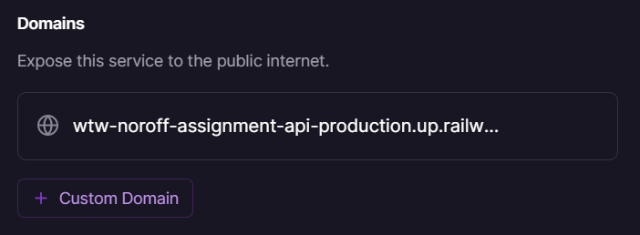

# Noroff Assignment API

The Noroff Assignment API will be used to complete each of the assignments using JavaScript Frameworks.

## Prerequisites
In order to use the API you will require the following:
1. Install [Git](https://git-scm.com/) 
2. Install [NodeJS LTS](https://nodejs.org/en/) with npm **(It must be the LTS version.)**
3. Create a [Railway](https://www.railway.app/) account (free 500 hours p/m)

## Instructions
Follow the below instructions to get your API setup and ready for use.

1. Fork this repository and clone the forked repository to your computer
2. Run `npm install` in the root of the cloned repository
3. Ensure you have the [Railway CLI Installed](https://docs.railway.app/develop/cli) by running `npm i -g @railway/cli` in your terminal app (Windows users)
4. Check that Railway is installed by running `railway --version`
5. Run the following commands (In the project root directory):
   * Initialize the project as a new Railway project `railway init`
   * Push the project Railway's cloud `railway up`
   * NOTE: You may be prompted to login; run `railway login` or `railway login --browserless`
6. The app will be automatically deployed and started.
7. Check the terminal and / or your [Railway dashboard](https://railway.app/dashboard) to see your deployed API.

## API Key and Authorization Header

Next, on your [Railway dashboard](https://railway.app/dashboard), open your API application, find the `Variables` tab and add the two required environmental variables. After adding your environmental variables, Railway will automatically redploy your application.

#### Click on the "+ New Variables" button:


#### **Enter TWO config vars:**
```bash
NODE_ENV : production
API_KEY : any randomly generated string (64 characters)
```
See the screenshot below.


## Generate a Domain for the API
Finally, click on the `Settings` tab. In the `Environment` section, click on the `⚡Generate Domain` button. A domain will be generated for your application, and the service will once again restart.


It will take a minute or two for the app to build and deploy, and then you will be able to access your API using the URL that has just been generated.



## Accessing Endpoints

Each API endpoint contains both open and protected endpoints. All `GET` endpoints are open. Any other method `POST`, `PUT`, `PATCH` and `DELETE` is protected with the `X-API-KEY` header.

### Trivia Game API
[Trivia API Docs](./docs/trivia.md)

### Lost in Translation API
[Lost In Translation](./docs/lost-in-translation.md)

### Pokémon Trainer API
[Pokémon Trainer](./docs/pokemon-trainer.md)

### Shelf Help (Books) API
[Shelf Help](./docs/books.md)

# Special thanks to Typicode for json-server

[Github: json-server](https://github.com/typicode/json-server)
